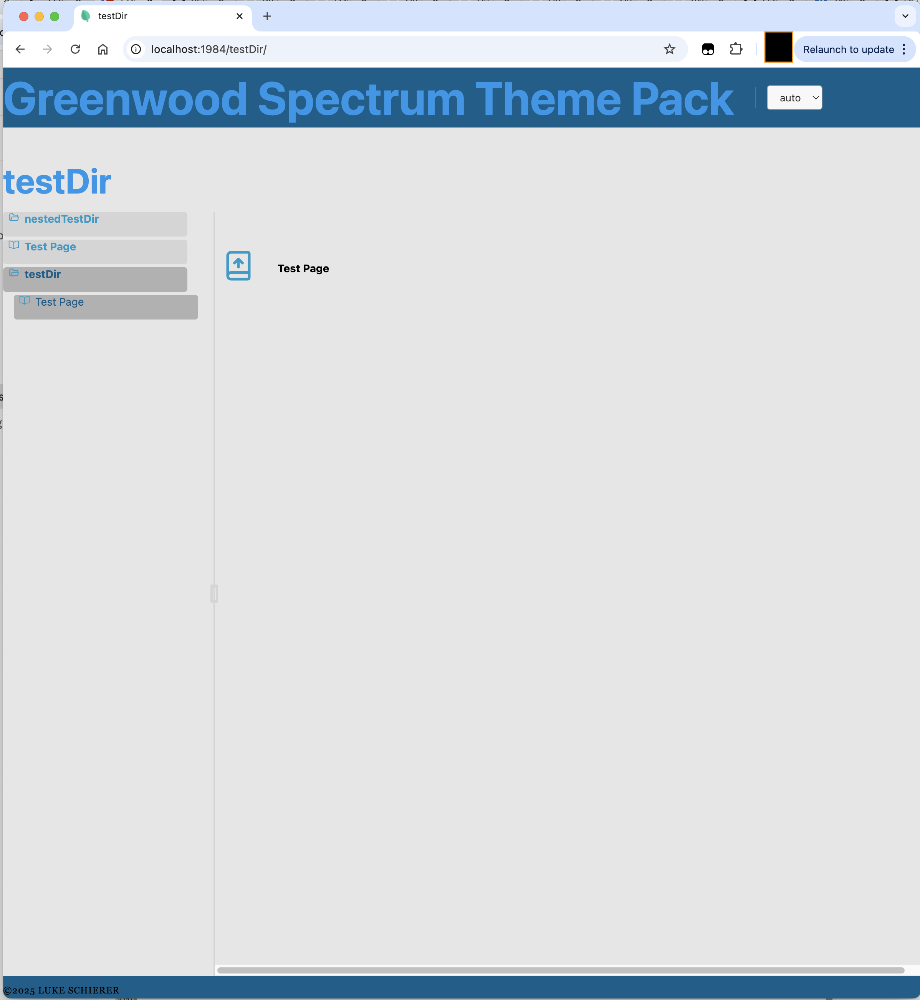

# GreenwoodSpectrumTheme
A theme pack for [Greenwood] using [Adobe Spectrum] CSS and Web Components. I found myself repeating my own work several times over, so I am centralizing the reused components in one place.

Some notes on running this:
* [mise], if installed will attempt to set up your environment for you to the extent it can.
  * This project assumes node version 22.14 or later.  There is a _chance_ it *might* work with an earlier version of 22, or possibly even version 21 or 20.
  * I am using [pnpm] for package management.
  * This requires [Greenwood] 0.32.0-alpha.8 or later.
  * I have attempted to keep the bash script in ./bin/ portable.  Any edits necessary should remain trivial.

[mise]: https://mise.jdx.dev
[pnpm]: https://pnpm.io/
[Adobe Spectrum]: https://spectrum.adobe.com/

This is intended to be a [Theme Pack].  It requires a configuration object, which conforms to the [zod] schema importable as ```{ Config } ``` either a type or an object from ```greenwoodspectrumtheme/config```.  You do not have to *use* [zod] in your own code, but the theme pack code itself will strictly enforce conformity with that schema.  This configuration object will get passed in as the options to the pack in your greenwood.config.js or .ts file:
```
import { greenwoodSpectrumThemePack } from "greenwoodspectrumtheme";

export default {
...
plugins: [
  ...greenwoodSpectrumThemePack(config),
]
}
```



[Greenwood]: https://greenwoodjs.dev/
[Theme Pack]: https://greenwoodjs.dev/guides/tutorials/theme-packs/
[zod]: https://zod.dev/
## CSS Variables for Layout Customization

This theme pack provides CSS variables that can be overridden by consuming projects to customize the layout:

```css
/* In your project's CSS */
:root {
  /* Adjust these values based on your project's header and footer sizes */
  --theme-header-height: 120px; /* Default is 100px */
  --theme-footer-height: 60px;  /* Default is 50px */
  /* No need to modify this one - it's calculated automatically */
  --theme-non-content-height: calc(var(--theme-header-height) + var(--theme-footer-height));
}
```

These variables control the layout of the split view and scrollable areas. Adjust them based on the actual size of your header and footer elements.
